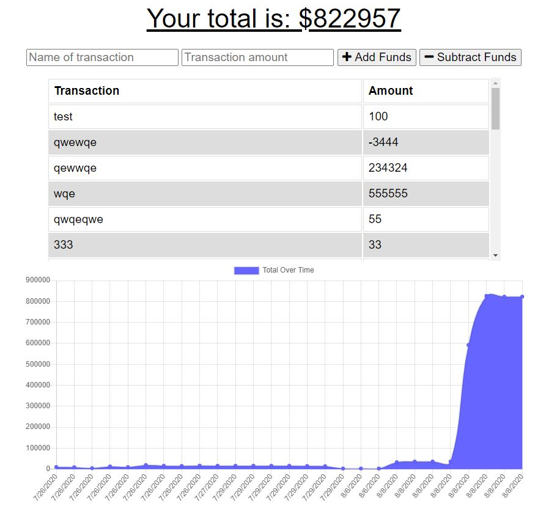

# Budget Tracker
Budget Tracker is a "Mobile-First" Progressive Web Application that allows users to **track** *income* and *expenses*. By using IndexedDB allows the app to be used both online and offline.

Deployed at: [Heroku](https://budget-tracker14.herokuapp.com/)

### Screenshot of Application


## User Story

```
As an avid traveler I want to be able to track my withdrawals and deposits with or without a data/internet connection so that my account balance is accurate when I am traveling.
```

### Technology Used
* Node
* IndexedDB
* MongoDB Atlas
* Deployed on [Heroku](https://budget-tracker14.herokuapp.com/)
* Express.js for the server

### Contact Me
[Email](matt.mcfadden14@gmail.com)

[GitHub](https://github.com/MatthewMcFadden)